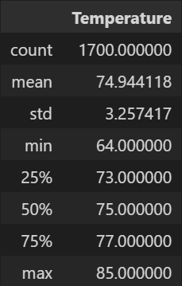
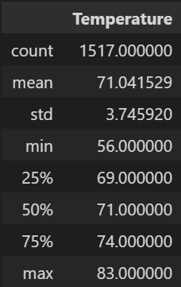

# Surfs Up

## Overview
We were asked to analyze the weather data in Oahu, Hawaii in order to find out if it is a suitable place for a surf and ice cream shop that operates year round. We used python and SQLAlchemy in order to read data from a database and filtered out June and December. 

## Results

### June Summary 


### December Summary 


Below are three major findings from the this analysis
- The mean tempurature for June is 74.9
- The mean temperature for December is 71.0 
- The temperatures are close enough in both summer and winter to be able to operate a surf and ice cream shop year round.

## Summary

### Summary of Results
What we have found is that Oahu is a suitable location to open up a surf and ice cream shop that operates year round. Analyzing the data, we can see that this location does not have much variation in temperature between winter and summer. Another piece of weather data that we can incorporate is the precipitation data for June and December. We can do that with the following queries.

### Additional Queries

```
# June
session.query(Measurement.prcp).filter(extract('month', Measurement.date) == 6).all()
# December
session.query(Measurement.prcp).filter(extract('month', Measurement.date) == 12).all()
```
